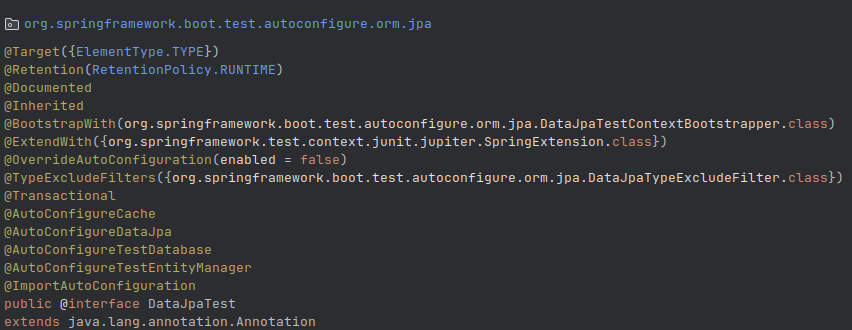

## a) Identify a couple of examples that use AssertJ expressive methods chaining.

- AssertJ in this project uses mainly the `assertThat` and for example it is used to find a employee in the BD by name and check if the name is correct.
```java
    @Test
    void whenFindAlexByName_thenReturnAlexEmployee() {
        // arrange a new employee and insert into db
        Employee alex = new Employee("alex", "alex@deti.com");
        entityManager.persistAndFlush(alex); //ensure data is persisted at this point
    
        // test the query method
        Employee found = employeeRepository.findByName(alex.getName());
        assertThat(found).isEqualTo(alex);
    }
```

- But they are not chain methods unlikely on the following method where we are testing the creation of a new employee with a mock mvc in to the REST API controller that depends of other components in this app:
```java
    @Test
    void whenValidInput_thenCreateEmployee() throws Exception {
        Employee bob = new Employee("bob", "bob@deti.com");
        mvc.perform(post("/api/employees").contentType(MediaType.APPLICATION_JSON).content(JsonUtils.toJson(bob)));
    
        List<Employee> found = repository.findAll();
        assertThat(found).extracting(Employee::getName).containsOnly("bob");
    }
 ```   

## b) Take note of transitive annotations included in @DataJpaTest.
- `@DataJpaTest` is a composed annotation that provides a convenient way to test only the BD's JPA applications. 
- It can be used in combination with `@AutoConfigureTestDatabase` or `@AutoConfigureTestEntityManager` to provide more fine-grained control over the configuration of the tests, can be customized by using `@AutoConfigureTestDatabase` and `@AutoConfigureTestEntityManager` annotations.


## c) Identify an example in which you mock the behavior of the repository (and avoid involving a database).
- In this example we are testing the creation of a new employee with a mock mvc in to the REST API controller that depends of other components in this app, so we need to mock the repository to avoid involving the database.
```java
    @Test
    void givenEmployees_whenGetEmployees_thenStatus200() throws Exception {
        createTestEmployee("bob", "bob@deti.com");
        createTestEmployee("alex", "alex@deti.com");
    
        mvc.perform(get("/api/employees").contentType(MediaType.APPLICATION_JSON))
                .andDo(print())
                .andExpect(status().isOk())
                .andExpect(content().contentTypeCompatibleWith(MediaType.APPLICATION_JSON))
                .andExpect(jsonPath("$", hasSize(greaterThanOrEqualTo(2))))
                .andExpect(jsonPath("$[0].name", is("bob")))
                .andExpect(jsonPath("$[1].name", is("alex")));
    }
 ```  

## d) What is the difference between standard @Mock and @MockBean?
- `@Mock` is used to create a mock object of a class or an interface, 
- `@MockBean` is used to add mock objects to the Spring application context.

## e) What is the role of the file “application-integrationtest.properties”? 
- This file is used to set up a testing environment with application integration tests with a database MySQL.

### In which conditions will it be used?
- It is used when we want to run integration tests with a simulated database MySQL.
- create-drop is used to create the database schema and drop it when the application is closed every time each test is run.

## f) the sample project demonstrates three test strategies to assess an API (C, D and E) developed with SpringBoot. Which are the main/key differences?
- `C` is a unit test that tests the controller and the service layer, but it mocks the repository layer.
- `D` is an integration test that tests the controller and the service layer, but it uses the real database with @TestPropertySource.
- `E` is an integration test that tests the controller and the service layer, but it uses a simulated database with @AutoConfigureTestDatabase.