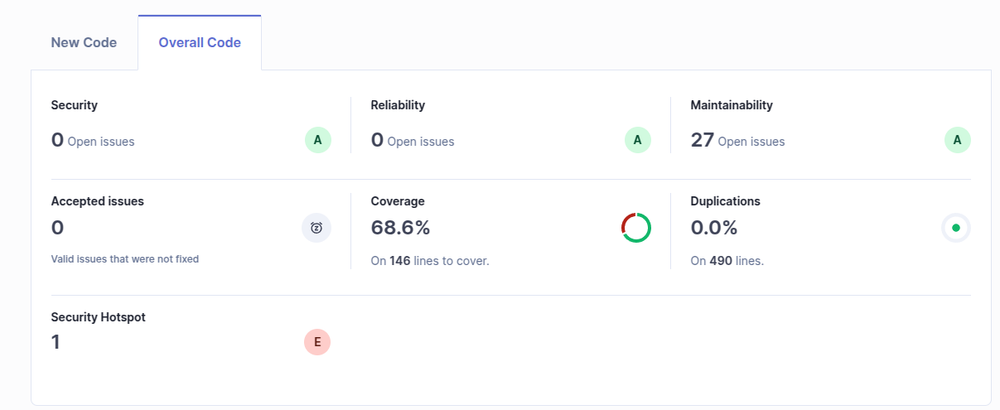

# f) Has your project passed the defined quality gate? Elaborate your answer

- According to the image in this repository (`SonarQube_dashboard.png`), the project has passed the quality gate with 68% Coverage (50% minimal required). 
  - The maintainability rating is A with 27 open issues
  - security hotspot rating is F due to Random() usage
  - Security rating is A with 0 vulnerabilities
  - Duplicated lines are 0%
  - Reliability rating is A with 0 bugs

# g)

| Issue            | Problem description               | How to solve                                                          |
|------------------|-----------------------------------|-----------------------------------------------------------------------|
| Security         | 0 vulnerabilities found, Rating A | No action needed                                                      |
| Reliability      | 0 bugs found, Rating A            | No action needed                                                      |
| Maintainability  | 27 code smells, Rating A          | Review and refactor code smells                                       |
| Security hotspot | Rating F due to Random() usage    | Replace `Random()` with `SecureRandom()` for cryptographic operations |

# h) n the configuration of Sonar, you can see references to external tools such as Checkstyle, PMD and SpotBugs related to Java analysis. What are they?
- Checkstyle: A development tool to help programmers write Java code that adheres to a coding standard. It automates the process of checking Java code for adherence to coding standards.
- PMD: A static code analysis tool that checks Java source code for potential problems, such as unused variables, empty catch blocks, unnecessary object creation, and so forth. It helps in identifying code that may be error-prone or inefficient.
- SpotBugs: A static analysis tool that looks for bugs in Java programs. It is a fork of the FindBugs project and uses static analysis to identify potential bugs in Java code, such as null pointer dereferences, infinite recursive loops, and other common programming errors.