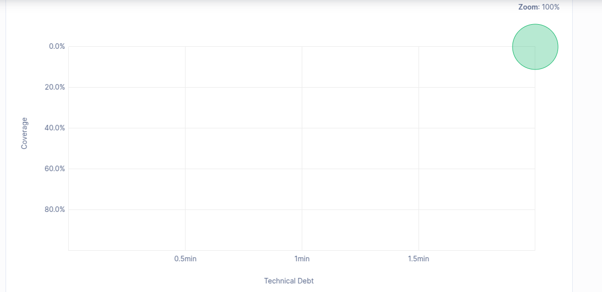

## c) Take note of the technical debt found (Measures > Overview). Explain the reported values.

- The technical debt is reported as 0.0% indicating that there are no issues or areas of improvement identified in the codebase that would contribute to technical debt. The code is clean, well-structured, and adheres to best practices, which minimizes the need for future refactoring or remediation efforts.

## d) Discuss the coverage values on the SonarQube dashboard (how many lines are “not covered”? And how many conditions? Are the values good?...)
- Coverage 0.0% with 51 lines to cover and 0 conditions to cover. This indicates that there are no tests or coverage for the codebase, which is not ideal. It is important to have a good level of test coverage to ensure the reliability and maintainability of the code. The lack of coverage suggests that the code may not be thoroughly tested, which could lead to potential issues in the future.

## f) It is likely that your project is failing the Quality Gate using the default Sonar Wat configuration. Which rule or rules are passing, which are failing?
- New code has 0 issues
- All new security hotspots are reviewed
- New code has sufficient test coverage
- Coverage is greater than or equal to 80.0%
- New code has limited duplications, duplicated Lines (%) is less than or equal to 3.0%